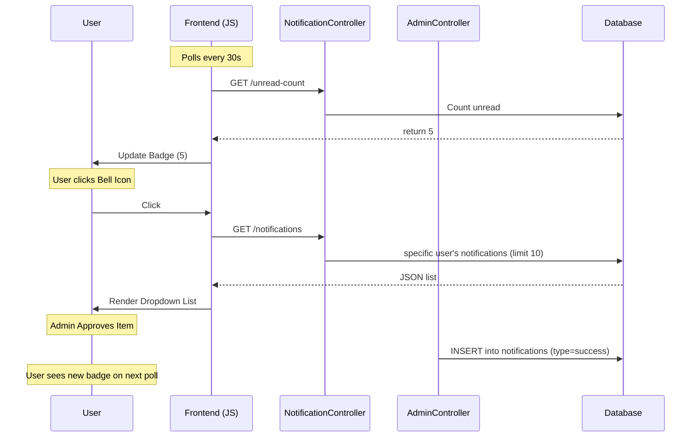

# Bell Notification System Documentation

This document outlines the architecture, flow, and usage of the notification system in the **GetReady** application.

## 1. Overview

The notification system is a **custom implementation** that does not strictly follow the standard Laravel `Notifiable` trait's database channel pattern (which typically uses a polymorphic `notifiable_type`/`id`). Instead, it uses a dedicated `notifications` table linked directly to the `users` table via `user_id`.

The system facilitates real-time-like feedback for:
*   Cloth approval status (Approved/Rejected)
*   Item resubmission (User -> Admin)
*   Rental return reminders (Automated)

## 2. Database Schema

**Table:** `notifications`

| Column | Type | Nullable | Description |
| :--- | :--- | :--- | :--- |
| `id` | bigint | No | Primary Key |
| `user_id` | bigint | No | Foreign Key to `users.id` |
| `title` | string | No | Short title of the notification |
| `message` | text | No | Full body text |
| `type` | string | No | Categorization: `info`, `success`, `warning`, `danger`, `order_reminder` |
| `icon` | string | Yes | Bootstrap Icon class (e.g., `bi-check-circle`) |
| `data` | json | Yes | Payload for dynamic actions (e.g., `cloth_id`, `reject_reason`) |
| `read` | boolean | No | Read status (default `false`) |
| `read_at` | timestamp | Yes | Timestamp when marked as read |
| `created_at` | timestamp | No | Creation timestamp |
| `updated_at` | timestamp | No | Update timestamp |

## 3. Backend Architecture

### Model: `App\Models\Notification`
*   **Relationships**: Belongs to `User`.
*   **Scopes**: `unread()`, `read()`, `recent($limit)`.
*   **Casts**: `data` is cast to `array`.

### Controller: `App\Http\Controllers\NotificationController`
Handles the API endpoints used by the frontend:
*   `GET /notifications`: Returns latest 10 notifications and unread count.
*   `GET /notifications/unread-count`: Lightweight endpoint for badge polling.
*   `POST /notifications/mark-read`: Marks a single ID as read.
*   `POST /notifications/mark-all-read`: Marks all unread notifications for the user as read.

### Triggers (Notification Sources)

1.  **Item Approval** (`AdminController@approveCloth`)
    *   **Trigger**: Admin clicks "Approve" in Cloth Approval screen.
    *   **Recipient**: Cloth Owner.
    *   **Type**: `success`.
    *   **Message**: "Item Approved".

2.  **Item Rejection** (`AdminController@rejectCloth`)
    *   **Trigger**: Admin rejects an item and provides a reason.
    *   **Recipient**: Cloth Owner.
    *   **Type**: `warning`.
    *   **Data**: Includes `reject_reason` and `cloth_id`. This allows the notification to link directly to the rejection details page.

3.  **Item Resubmission** (`RejectionController@update`)
    *   **Trigger**: User updates a rejected cloth.
    *   **Recipient**: Admin (hardcoded `user_id => 1`).
    *   **Type**: `info`.
    *   **Message**: "Item Resubmitted for Approval".

4.  **Return Reminders** (`Console command: app:send-return-reminders`)
    *   **Trigger**: Scheduled cron job (daily).
    *   **Recipient**: Users with active rentals.
    *   **Scenarios**:
        *   **Due Tomorrow**: "Upcoming Return Due Date".
        *   **Due Today**: "Return Due Today".
        *   **Overdue**: "Rental Overdue".

## 4. Frontend Architecture

### UI Component (`resources/views/layouts/header.blade.php`)
*   Contains the Bell Icon (`bi-bell`).
*   Contains a badge span (`#notification-badge`) shown only when `unreadCount > 0`.
*   Contains the dropdown container (`#notification-dropdown`).

### Logic Script (`public/js/notifications.js`)
*   **Polling**: Every **30 seconds**, it calls `/notifications/unread-count` to update the badge number.
*   **Lazy Loading**: When the bell is clicked, it fetches the full list via `/notifications`.
*   **Interactions**:
    *   **Clicking an item**: Marks it as read immediately.
    *   **Rejection Links**: If the notification contains `reject_reason` data, clicking it redirects the user to `/rejections/{id}`.
    *   **Mark All Read**: Button to clear all notifications.

## 5. Flow Diagram

